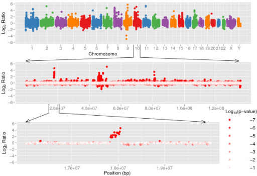
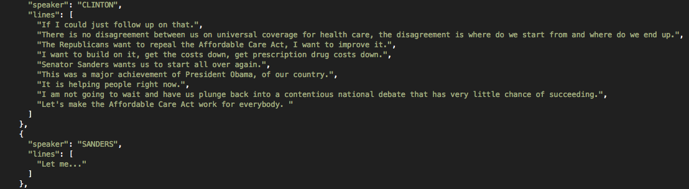
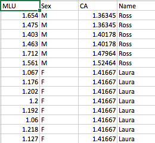
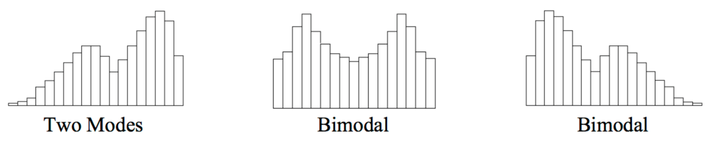

```{r setup, include=FALSE}
options(htmltools.dir.version = FALSE)
knitr::opts_chunk$set(fig.width = 5, fig.height = 4) 
library(ggplot2)
library(tibble)
library(dplyr)
```


# Today

--

- What is "sample data"? 

--

- What does it look like?

--

- What properties of data are meaningful, vulnerable, and robust (i.e., invariant) under specific conditions?

---
class: center, middle, inverse

# What does data look like?

---
class: center, middle


---
class: center, middle



---
class: center, middle




---
class: center, middle




---
class: center, middle


---
class: center, middle


---
class: center, middle, inverse

# What does your data look like?

Take 2 minutes

---
class: center, middle, inverse

## At some point in the research process, "data" becomes a list of numbers

--

## This list is often very long!

--

## So how do you talk about your data with others?

---
class: inverse, center, middle

# Two ways to talk to others about your data

--

## Words

--

## Plots


---

# Talking about data

Categorical vs quantitative

--

We need a common language

--

For quantitative data:

1. Central tendency
2. Spread
3. Shape

---
class: center

# A simple sample

Data as a list of numbers


```{r}
x <- c(1, 4, 5, 8, 15)
x
```


--

```{r echo = FALSE}
n <- 5 # number of obs in sample
s <- 1 # number of samples
sample_tibble <- tibble(x = x, 
                        y = rep(1:s, each = n))
ggplot(sample_tibble, aes(x = x, y = factor(y))) +
  geom_point(colour = "#3498CC", size = 8) +
  geom_text(aes(label = x), nudge_y = 0.1, size = 6) +
  theme_void()
```


---

# List-wise operations

--

What happens to a list of numbers when we apply the same transformation to every number in the list?

--

List-wise operations can be summarized in a simple equation

--

$$y = x + 2$$


*<center>“add 2 to every number in list $x$ and put this in a new list called $y$”</center>*


---
class: center

# List-wise addition

$$y = x + 2$$


What changed? What didn't?


```{r echo = FALSE}
n <- 5 # number of obs in sample
s <- 2 # number of samples
add_tibble <- tibble(x = c(x, x + 2), 
                     y = rep(1:s, each = n))
add_plot <- ggplot(add_tibble, aes(x = x, y = factor(y))) +
  geom_point(colour = "#3498CC", size = 8) +
  scale_y_discrete(limits = rev(levels(factor(add_tibble$y)))) +
  geom_text(aes(label = x), nudge_y = 0.15, size = 6) +
  theme_void()
add_plot
```


---
class: center

# List-wise subtraction

$$y = x - 2$$

What changes? What stays the same?

Take 2 minutes

---
class: center

# List-wise subtraction

$$y = x - 2$$

What changes? What stays the same?

--


```{r echo = FALSE}
sub_tibble <- tibble(x = c(x, x - 2), 
                     y = rep(1:s, each = n))
sub_plot <- ggplot(sub_tibble, aes(x = x, y = factor(y))) +
  geom_point(colour = "#3498CC", size = 8) +
  scale_y_discrete(limits = rev(levels(factor(sub_tibble$y)))) +
  geom_text(aes(label = x), nudge_y = 0.15, size = 6) +
  theme_void()
sub_plot
```

---
class: center

# List-wise multiplication

$$y = x \times 2$$

What changed? What didn't?


```{r echo = FALSE}
mult_tibble <- tibble(x = c(x, 2*x), 
                      y = rep(1:s, each = n))
mult_plot <- ggplot(mult_tibble, aes(x = x, y = factor(y))) +
  geom_point(colour = "#3498CC", size = 8) +
  scale_y_discrete(limits = rev(levels(factor(mult_tibble$y)))) +
  geom_text(aes(label = x), nudge_y = 0.15, size = 6) +
  theme_void()
mult_plot
```


---
class: center

# List-wise division

$$y = x \div 2$$

What changes? What stays the same?

Take 2 minutes

---
class: center

# List-wise division

$$y = x \div 2$$

What changes? What stays the same?

--


```{r echo = FALSE}
div_tibble <- tibble(x = c(x, x/2), 
                     y = rep(1:s, each = n))
div_plot <- ggplot(div_tibble, aes(x = x, y = factor(y))) +
  geom_point(colour = "#3498CC", size = 8) +
  scale_y_discrete(limits = rev(levels(factor(div_tibble$y)))) +
  geom_text(aes(label = x), nudge_y = 0.15, size = 6) +
  theme_void()
div_plot
```


---

# Invariance properties

The question of what does not change during statistical operations refers to invariance properties

--

What stays constant under certain transformations is a key concept is modern statistics, as well as other branches of science

--

Einstein actually wanted to call his theory of relativity the “theory of invariants”- what remains invariant in the space-time continuum (http://www.economist.com/node/3518580)

---

# What did we just show?

List-wise addition or subtraction 
- Moves the numbers as a group, as though they were mounted on a rigid stick, and slid to the left or right.
- Does not change any of the distances between numbers.

--

List-wise multiplication or division
- Can move the numbers as a group
- But also causes them to "fan in" or "fan out."


---

# Limitations of lists

--

Number of rows/columns

--

We started by showing how all the information in a list of $n$ numbers can be re-expressed in terms of $n$ new numbers

$$ list_x \longrightarrow list_y$$
--

These new numbers contain all the information in the original list, and the original list can be perfectly reconstructed from the new list

---

# Descriptive statistics

Measures of location or central tendency
- In general, in what region is the list located on the number line?
- What number is typical of the entire list?
- What number is in the center of the list?

--

Measures of spread or variability
- How far is the list spread out over the number line?

--

Measures of shape
- Pattern of relative interval sizes, moving from left to right


---
class: inverse, center, middle

# The center

Mode

Median

Mean

---

# The sample mode

The most frequently occurring value in a list

```{r}
# compute the statistical mode of a vector of numbers
stat.mode <- function(x) {
    freqs <- tapply(x, x, length)
    as.numeric(names(freqs)[which.max(freqs)][1])
}
stat.mode(x)
```

You don't need to understand the above R function

---

# The sample mean

The arithmetic mean of the data

$$\bar{x}=\frac{1}{n}\sum_{i=1}^nx_i$$

where $x_1, x_2, x_3, \dots, x_n$ represent the $n$ observed values.

--

Number with the smallest sum of *squared* distances to the list of numbers

--

Hence, the mean is a *least squares estimator*

--

Unless ALL scores are identical, most if not all, scores will be different from the mean.

---
class: middle, center

# The sample mean

```{r}
x <- c(1, 4, 5, 8, 15)
mean(x)
```

```{r echo = FALSE}
ggplot(sample_tibble, aes(x = x, y = factor(y))) +
  geom_point(colour = "#3498CC", size = 8) +
  geom_text(aes(label = x), nudge_y = 0.1, size = 6) +
  geom_segment(aes(x = mean(sample_tibble$x[1:5]), # group = 1
                   y = .8, 
                   xend= mean(sample_tibble$x[1:5]),
                   yend= 1.2),
               lty = 3) +
  theme_void()
```

---
class: middle, center, inverse


# What happens to the **center** if we do list-wise addition?

---
class: middle, center

# $$y = x + 2$$

```{r include = FALSE}
y <- x + 2
```


```{r}
mean(x)
mean(y)
```

--

```{r echo = FALSE}
add_plot +
  geom_segment(aes(x = mean(add_tibble$x[6:10]), # group = 2
                   y = .8, 
                   xend= mean(add_tibble$x[6:10]),
                   yend= 1.2),
               lty = 3) +
  geom_segment(aes(x = mean(add_tibble$x[1:5]), # group = 1
                   y = 1.8, 
                   xend= mean(add_tibble$x[1:5]),
                   yend= 2.2),
               lty = 3) 
```


---
class: center, middle, inverse

# What happens to the **center** if we do list-wise subtraction?

---
class: center, middle

# $$y = x - 2$$


```{r include = FALSE}
y <- x - 2
```


```{r}
mean(x)
mean(y)
```

--

```{r echo = FALSE}
sub_plot +
  geom_segment(aes(x = mean(sub_tibble$x[6:10]), # group = 2
                   y = .8, 
                   xend= mean(sub_tibble$x[6:10]),
                   yend= 1.2),
               lty = 3) +
  geom_segment(aes(x = mean(sub_tibble$x[1:5]), # group = 1
                   y = 1.8, 
                   xend= mean(sub_tibble$x[1:5]),
                   yend= 2.2),
               lty = 3) 
```

---
class: center, middle, inverse

# What about the median?


Take 2 minutes


---

# The sample median


- Order the numbers from highest to lowest
- If number of numbers is odd, choose the middle
- If number of numbers is even, choose the average of the 2 middle values

---

# What about the median?

```{r}
y <- x + 2
median(x)
median(y)
```

```{r}
y <- x - 2
median(x)
median(y)
```

---
class: center, middle

# The median after addition

$$y = x + 2$$

```{r echo = FALSE}
add_plot +
  geom_segment(aes(x = median(add_tibble$x[6:10]), # group = 2
                   y = .8, 
                   xend= median(add_tibble$x[6:10]),
                   yend= 1.2),
               lty = 3) +
  geom_segment(aes(x = median(add_tibble$x[1:5]), # group = 1
                   y = 1.8, 
                   xend= median(add_tibble$x[1:5]),
                   yend= 2.2),
               lty = 3) 
```

---
class: center, middle

# The median after subtraction

$$y = x - 2$$

```{r echo = FALSE}
sub_plot +
  geom_segment(aes(x = median(sub_tibble$x[6:10]), # group = 2
                   y = .8, 
                   xend= median(sub_tibble$x[6:10]),
                   yend= 1.2),
               lty = 3) +
  geom_segment(aes(x = median(sub_tibble$x[1:5]), # group = 1
                   y = 1.8, 
                   xend= median(sub_tibble$x[1:5]),
                   yend= 2.2),
               lty = 3) 
```

---
class: center, middle, inverse

# List-wise addition & subtraction come straight through to the center

$$c_y = c_x \pm b $$


---
class: center, middle, inverse

# What happens to the center if we do list-wise multiplication?


---
class: center, middle

# $$y = x \times 2$$

```{r include = FALSE}
y <- x*2
```

```{r}
mean(x)
mean(y)
```

--

```{r echo = FALSE}
mult_plot +
  geom_segment(aes(x = mean(mult_tibble$x[6:10]), # group = 2
                   y = .8, 
                   xend= mean(mult_tibble$x[6:10]),
                   yend= 1.2),
               lty = 3) +
  geom_segment(aes(x = mean(mult_tibble$x[1:5]), # group = 1
                   y = 1.8, 
                   xend= mean(mult_tibble$x[1:5]),
                   yend= 2.2),
               lty = 3) 
```

---
class: center, middle, inverse

# What happens to the center if we do list-wise division?

---
class: center, middle

# $$y = x \div 2$$

```{r include = FALSE}
y <- x/2
```


```{r}
mean(x)
mean(y)
```

--

```{r echo = FALSE}
div_plot +
  geom_segment(aes(x = mean(div_tibble$x[6:10]), # group = 2
                   y = .8, 
                   xend= mean(div_tibble$x[6:10]),
                   yend= 1.2),
               lty = 3) +
  geom_segment(aes(x = mean(div_tibble$x[1:5]), # group = 1
                   y = 1.8, 
                   xend= mean(div_tibble$x[1:5]),
                   yend= 2.2),
               lty = 3) 
```


---
class: center, middle, inverse


# List-wise multiplication/division comes straight through to the **center**.

$$c_y = a \times c_x $$

---

# Linear transformation theory

| Operation  | Center  | Spread           | Shape|
|:----------:|:-------:|:----------------:|:----:|
| $+$        | $+$     | ?                | ?  |
| $-$        | $-$     | ?                | ?  |
| $\times$   | $\times$| ?                | ?  |
| $\div$     | $\div$  | ?                | ?  |

--

So the central tendency of any list of numbers is affected by *all* possible linear transformations.

---
class: center, middle, inverse


# What happens to the **spread**?

Take 2 minutes
$$ y = x + 2$$
$$ z = (x \times 2) + 2$$
---
class: inverse, center, middle

# The spread

Standard deviation/variance

Median absolute deviation

Interquartile range

Min-to-max range

---

# Standard deviation 

$$s = \sqrt{\frac{1}{n-1} \sum_{i=1}^n (x_i - \bar{x})^2} $$

```{r}
x <- c(1, 4, 5, 8, 15)
sd(x)
y <- x + 2
sd(y)
z <- x*2 + 2
sd(z)
```


---
class: center, middle, inverse

## List-wise addition/subtraction have no effect on **spread**...

--

## But, list-wise multiplication/division come straight through to the **spread**.

--

$$s_y = a \times s_x $$

---

# Linear transformation theory

| Operation  | Center  | Spread           | Shape|
|:----------:|:-------:|:----------------:|:----:|
| $+$        | $+$     | nothing changes  | ?  |
| $-$        | $-$     | nothing changes  | ?  |
| $\times$   | $\times$| $\times$         | ?  |
| $\div$     | $\div$  | $\div$           | ?  |

--

So you can only affect the spread of a list of numbers by using multiplication/division.


---

# Shape

- Modality [think: mounds]

--

- Skewness [think: symmetry]

--

- Kurtosis [think: peakedness]

---
class: center

# Modality



---

#  start here

```{r}
x <- rnorm(100,50,12) #draws 100 samples from normal dist., M=50, SD=12
y <- 2*x + 5 #y is a linear transformation of x
z.x <- (x - mean(x))/sd(x) #makes z-scores using x
z.y <- (y - mean(y))/sd(y) #makes z-scores using y
head(z.x) #show the first six numbers in z.x
#[1]  0.3053039  0.4164851 -0.3180144 -0.6267830  0.3235671 -1.8508084
head(z.y) #show the first six numbers in z.y
#[1]  0.3053039  0.4164851 -0.3180144 -0.6267830  0.3235671 -1.8508084
```

What does the above show?
What will be the location, spread, and shape of the new numbers in z.x? In z.y?

---

# Skewness

Skewness statistics provide information about departures from symmetry

--

Draws on all 3 measures of location

--

The standard definition of skewness in a population is the average cubed z-score

--


---


# Calculating skewness

Here is one way to calculate skewness, using the formula for the adjusted Fisher-Pearson standardized moment coefficient, $G_1$:

$$G_1 = \frac{n}{(n-1)(n-2)}\sum_{i=1}^n {\frac{x_i - \bar{x}}{x}}^3$$


```{r}
g1_calculate <- function(x = data){
  s3.x <- sum((x-mean(x))^3/sd(x)^3) # right side of eq
  n <- length(x)
  g1 <- (n/((n-1)*(n-2)))*s3.x
  return(g1)
}
```


---


# Calculating skewness
```{r}
# install.packages("moments")
library(moments)
skewness(x)
```


---

# Kurtosis

The basic idea of kurtosis is that it is the average 4th power of the z-scores
Kurtosis of a distribution is typically expressed relative to that of a normal distribution.

--

The normal distribution has a kurtosis of 3. So, the most common measure of kurtosis is the average 4th power of the z-scores minus 3.

--

This can be computed in a number of ways. The simplest version is biased for a normal distribution, but is reported by some programs.

--

If the data have high kurtosis due to long tails, then the sample mean may be an unreliable estimator of the population mean.

--

Standard formulas for the variance of the sample correlation and sample variance can be seriously in error if the data come from a population with high kurtosis.

---

# Calculating kurtosis

```{r}
s4.x <- sum((x-mean(x))^4) #using raw
s2.x <- sum((x-mean(x))^2) #using raw
n <- length(x)
n*s4.x/s2.x^2
# [1] 2.438948
s4.z <- sum((z.x-mean(z.x))^4) #using z
s2.z <- sum((z.x-mean(z.x))^2) #using z
n*s4.z/s2.z^2
# [1] 2.438948
```

---
class: center, middle, inverse

# All list-wise operations have no effect on shape.

---

# Linear transformation theory

| Operation  | Center  | Spread           | Shape            |
|:----------:|:-------:|:----------------:|:----------------:|
| $+$        | $+$     | nothing changes  | nothing changes  |
| $-$        | $-$     | nothing changes  | nothing changes  |
| $\times$   | $\times$| $\times$         | nothing changes  |
| $\div$     | $\div$  | $\div$           | nothing changes  |


---
class: center, middle

# Review: list-wise addition & subtraction


$$y = x \pm b$$

--

Center $$c_y = c_x \pm b$$

--

Spread $$s_y = s_x$$

---
class: center, middle

# Review: list-wise addition & multiplication


$$y = (a \times x) \pm b$$

--

Center $$c_y = (a \times c_x)  \pm b$$

--

Spread $$s_y = (a \times s_x)$$

---
class: center, middle

# Review: list-wise subtraction & division


$$y = \frac{x - b}{a}$$

--

Center $$c_y = \frac{c_x - b}{a}$$

--

Spread $$s_y = \frac{s_x}{a}$$

---

# Linear Transformations

Finding $a$ and $b$, given $\bar{y}$ and $s_y$

--

How are the mean and sd affected by linear transformation?

$$\bar{y} = a \bar{x} + b$$

$$s_{y} = as_x$$
--

There are two unknowns in these equations: $a$ and $b$

--


Take 2 minutes to solve for $a$ and $b$

Try solving for $a$ in the second equation first.

---

# Linear Transformations

--


$$a = \frac{s_{y}}{s_{x}}$$


$$b = \bar{y} - a \bar{x}$$

---

# What if we want z-scores?

So, given $\bar{y} = 0$ and $s_y= 1$, what are $a$ and $b$?

Take 2 minutes

--


$$a = \frac{1}{s_{x}}$$
and

$$b = -a\bar{x}$$

---
class: center, middle

# Goal: linear rescaling

| Operation  | Center  | Spread           | Shape            |
|:----------:|:-------:|:----------------:|:----------------:|
| $+$        | $+$     | nothing changes  | nothing changes  |
| $-$        | $-$     | nothing changes  | nothing changes  |
| $\times$   | $\times$| $\times$         | nothing changes  |
| $\div$     | $\div$  | $\div$           | nothing changes  |

--

Change center only?

--

$$y = x \pm b$$ 

--

Change center & spread?

--

$$y = (a \times x) \pm b$$

--

Change shape?


---

- We explored quantitative data using different types of graphic plots

--

- We developed some intuition about properties of our data that are meaningful, vulnerable, and robust (i.e., invariant) under specific conditions

--

- We discussed and calculated meaningful descriptive statistics to measure location, spread, and shape

--

- We demonstrated how list-wise operations can impact measures of location, spread, and shape

--

- We have proven that for any list of numbers with non-zero spread, the z-score transformation produces numbers with the same shape (same skewness, same kurtosis) as the original numbers but with location of 0 and spread of 1.

